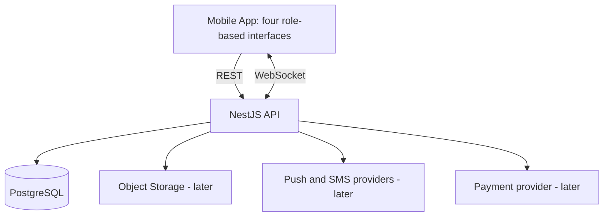
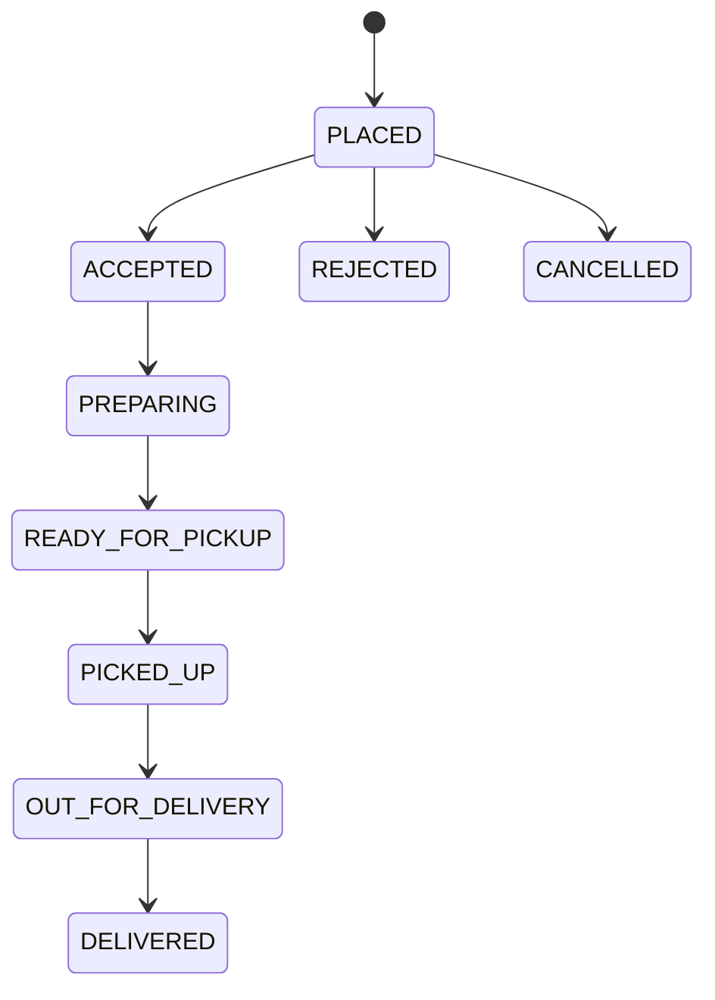
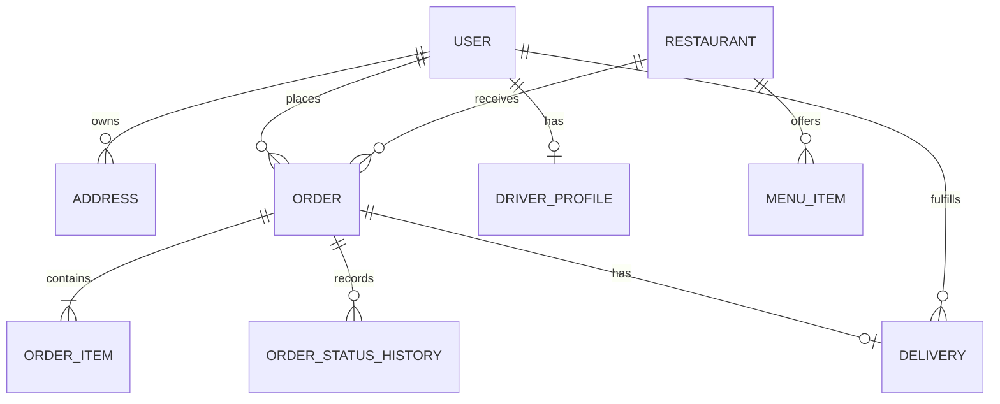

# مواصفات مشروع تطبيق توصيل طلبات متعدد الأدوار

> هذا الملف هو المرجع الأساسي للمشروع، ومكتوب ليُعطى إلى Codex حتى ينشئ المشروع وينفذه على مراحل.  
> اسم المشروع المؤقت: **Wasel**. يمكن تغييره لاحقًا دون تغيير التصميم التقني.

---

## 1. تعليمات مباشرة إلى Codex

أنت تعمل على بناء تطبيق توصيل مطاعم حقيقي يعمل على Android وiOS. اقرأ هذا الملف كاملًا قبل تعديل أي ملف.

قواعد العمل:

1. إذا كان المجلد يحتوي مشروعًا موجودًا، افحصه أولًا ولا تحذف أو تستبدل عملًا موجودًا.
2. إذا كان المجلد فارغًا، أنشئ Monorepo جديدًا وفق الهيكل الموجود في هذا المستند.
3. استخدم أحدث إصدارات مستقرة ومتوافقة من المكتبات. لا تستخدم إصدارات تجريبية.
4. نفّذ المشروع على مراحل؛ لا تحاول بناء جميع الميزات دفعة واحدة.
5. ابدأ في أول جلسة بتنفيذ **المرحلة 0 والمرحلة 1 فقط**، ثم شغّل الفحوصات وأعطِ تقريرًا واضحًا بما تم.
6. لا تستخدم أي خدمة مدفوعة أثناء التطوير. استخدم PostgreSQL محليًا وبيانات تجريبية.
7. لا تضع مفاتيح API أو كلمات مرور حقيقية داخل Git. أنشئ `.env.example` فقط.
8. لا تثق بأي سعر أو `role` أو `userId` يرسله تطبيق الهاتف؛ تحقق من كل شيء في الـBackend.
9. اكتب كودًا واضحًا، واستخدم TypeScript بوضع strict، وأضف اختبارات للمنطق الحساس.
10. حدّث `README.md` و`docs/progress.md` بعد كل مرحلة.
11. إذا وجدت قرارًا صغيرًا غير محدد، اختر أبسط قرار قابل للتعديل ووثّقه. اسأل المستخدم فقط عند وجود مانع حقيقي أو قرار تجاري يغيّر المنتج.

الهدف ليس Prototype شكلي فقط؛ المطلوب أساس نظيف وقابل للتوسعة، مع إبقاء النسخة الأولى صغيرة وقابلة للتشغيل.

---

## 2. فكرة المشروع

تطبيق واحد لتوصيل طلبات الطعام يعمل على Android وiOS، ويحتوي أربعة أدوار رئيسية:

1. `CUSTOMER`: الزبون.
2. `RESTAURANT`: المطعم أو موظف المطعم.
3. `DRIVER`: مندوب التوصيل.
4. `ADMIN`: مدير النظام.

بعد تسجيل الدخول، يعيد الـBackend بيانات المستخدم ودوره. يبني التطبيق واجهته ومساراته حسب الدور، لكن الحماية الحقيقية تكون دائمًا داخل الـBackend، وليس عن طريق إخفاء الأزرار فقط.

في النسخة الأولى سيكون لكل مستخدم دور واحد. دعم أكثر من دور لنفس الحساب يمكن إضافته لاحقًا إذا ظهرت حاجة حقيقية.

---

## 3. حدود النسخة الأولى MVP

### ما يجب أن يعمل

- إنشاء حساب زبون باستخدام البريد الإلكتروني وكلمة المرور.
- تسجيل الدخول والخروج وتجديد جلسة الدخول.
- عرض المطاعم المفتوحة وقوائم الطعام.
- إضافة عنوان للزبون.
- إنشاء طلب من مطعم واحد والدفع عند الاستلام.
- حساب السعر من الـBackend وتخزين نسخة من اسم وسعر كل صنف وقت الطلب.
- مشاهدة الزبون لحالة طلبه وتاريخ طلباته.
- مشاهدة المطعم للطلبات الواردة وقبولها أو رفضها وتحديث تجهيزها.
- تفعيل المندوب لحالة `ONLINE`، وقبوله مهمة توصيل، وتحديث مراحل التوصيل.
- لوحة أساسية للمدير داخل التطبيق لإدارة المستخدمين والمطاعم والطلبات.
- إشعارات داخل التطبيق، ثم Push Notifications في مرحلة لاحقة.
- بيانات Seed وحسابات تجريبية لكل دور.

### خارج النسخة الأولى

- الدفع الإلكتروني الحقيقي.
- تسجيل الدخول باستخدام SMS OTP.
- كوبونات وعروض معقدة.
- طلب من عدة مطاعم في سلة واحدة.
- دردشة مباشرة بين الأطراف.
- نظام محاسبي وتسويات مالية متكامل.
- خوارزمية ذكية متقدمة لتوزيع الطلبات على المندوبين.
- Microservices أو Kubernetes.
- تتبع طويل المدى لكل نقطة GPS.
- تطبيق ويب منفصل للإدارة.

هذه الميزات ليست ملغاة؛ تؤجل حتى تعمل دورة الطلب الأساسية كاملة.

---

## 4. التقنيات المعتمدة

| الجزء | التقنية | سبب الاختيار |
|---|---|---|
| تطبيق الهاتف | React Native + Expo + TypeScript | كود واحد لـAndroid وiOS، واستخدام TypeScript في المشروع كاملًا |
| التنقل | Expo Router أو React Navigation | فصل واجهات ومسارات كل دور بوضوح؛ اختر الأنسب المتوافق مع إصدار Expo المستقر |
| إدارة بيانات الخادم | TanStack Query | Caching، حالات التحميل، إعادة المحاولة، وتحديث البيانات بطريقة منظمة |
| الحالة المحلية | Zustand عند الحاجة فقط | خفيف ومناسب للجلسة والسلة؛ لا تستخدمه بدل بيانات الخادم |
| Backend | NestJS + TypeScript | Modules وGuards وValidation ودعم جيد لمشروع متوسط قابل للتوسعة |
| API | REST + OpenAPI/Swagger | واضح وسهل الاختبار؛ WebSocket يستخدم فقط للتحديثات الحية |
| قاعدة البيانات | PostgreSQL | ممتاز للعلاقات والمعاملات والقيود والاستعلامات المعقدة، ويدعم PostGIS لاحقًا |
| ORM | Prisma | Schema واضح، migrations، type safety، وسرعة في تطوير الـBackend |
| التحديثات الحية | NestJS WebSocket Gateway باستخدام Socket.IO | تحديث حالة الطلب وموقع المندوب دون polling مستمر |
| كلمات المرور | Argon2id أو bcrypt | تخزين hash آمن بدل تخزين كلمة المرور نفسها |
| الاختبارات | Jest + Supertest | Unit وIntegration وE2E للـBackend |
| التشغيل المحلي | Docker Compose | تشغيل PostgreSQL بطريقة موحدة على جميع الأجهزة |
| Package manager | pnpm workspaces | Monorepo سريع مع إدارة موحدة للحزم |
| CI | GitHub Actions | تشغيل lint وtypecheck وtests تلقائيًا |

### لماذا PostgreSQL وليس MySQL؟

الاثنان قواعد بيانات علائقية جيدة، لكن PostgreSQL أنسب لهذا المشروع للأسباب التالية:

- المشروع يحتوي علاقات ومعاملات كثيرة بين المستخدم والمطعم والطلب والمندوب والدفع.
- PostgreSQL صارم في القيود وصحة البيانات، وهذا مهم للطلبات والأموال.
- يدعم `JSONB` عند الحاجة، دون تحويل كل النظام إلى قاعدة NoSQL.
- يمكن إضافة `PostGIS` لاحقًا لإيجاد أقرب مطعم أو مندوب والعمل مع مناطق التوصيل.
- مناسب للاستعلامات والتقارير المعقدة مع نمو المشروع.

في المرحلة الأولى نخزن `latitude` و`longitude` كقيم رقمية عادية. لا نضف PostGIS حتى نحتاج استعلامات جغرافية فعلية. عند إضافته، قد نحتاج SQL migration مخصصًا وRaw SQL لبعض العمليات لأن دعم Prisma للأنواع الجغرافية قد يتطلب معالجة خاصة.

### لماذا Modular Monolith وليس Microservices؟

النسخة الأولى تُبنى كـBackend واحد مقسم إلى Modules واضحة. هذا يعطي فصلًا منطقيًا دون تكلفة تشغيل وتعقيد الاتصال بين عدة خدمات. يمكن فصل Module مثل Notifications أو Dispatch إلى خدمة مستقلة لاحقًا عند وجود حمل حقيقي، وليس لمجرد أن Microservices تبدو متقدمة.

---

## 5. الهيكل العام للنظام



REST هو المصدر الأساسي للبيانات، وWebSocket يرسل إشعارًا بأن الطلب تغير. عند إعادة فتح التطبيق يجب جلب الحالة الصحيحة من REST؛ لا يعتمد النظام على وصول كل WebSocket event.

---

## 6. صلاحيات الأدوار

| العملية | Customer | Restaurant | Driver | Admin |
|---|:---:|:---:|:---:|:---:|
| إنشاء حساب ذاتيًا | نعم | لا | لا | لا |
| عرض المطاعم والقوائم | نعم | مطعمه | عند الحاجة | نعم |
| إنشاء طلب | نعم | لا | لا | عند الدعم فقط |
| عرض الطلب | طلباته | طلبات مطعمه | الطلب المعيّن له | جميع الطلبات |
| قبول/رفض طلب مطعم | لا | نعم، لمطعمه فقط | لا | تجاوز مراقب |
| تعديل قائمة الطعام | لا | نعم، لمطعمه فقط | لا | نعم |
| قبول مهمة توصيل | لا | لا | نعم | تعيين يدوي |
| تحديث موقع المندوب | لا | لا | حسابه فقط | قراءة عند الحاجة |
| تغيير حالة التوصيل | لا | لا | للطلب المعيّن له | تجاوز مراقب |
| إدارة المستخدمين والأدوار | لا | لا | لا | نعم |

مهم جدًا: الزبون لا يستطيع إرسال `role: ADMIN` أو `role: DRIVER` عند التسجيل. حسابات المطاعم والمندوبين ينشئها المدير أو يوافق عليها من خلال مسار إداري محمي.

---

## 7. متطلبات كل دور

### 7.1 الزبون Customer

- التسجيل وتسجيل الدخول.
- عرض المطاعم المفتوحة مع البحث الأساسي.
- فتح المطعم ورؤية التصنيفات والأصناف المتاحة.
- إضافة أصناف من مطعم واحد إلى السلة.
- تغيير الكمية وحذف صنف من السلة.
- إضافة عنوان واختياره.
- مراجعة ملخص السعر قبل إنشاء الطلب.
- إنشاء طلب `CASH_ON_DELIVERY`.
- متابعة الحالة الحالية والتاريخ الزمني للطلب.
- إلغاء الطلب فقط ضمن الحالات التي يسمح بها الـBackend.
- عرض الطلبات السابقة وإعادة بناء سلة منها لاحقًا.
- تقييم الطلب بعد التسليم في مرحلة لاحقة.

### 7.2 المطعم Restaurant

- تسجيل الدخول بحساب وافق عليه المدير.
- فتح أو إغلاق استقبال الطلبات.
- إدارة بيانات المطعم الأساسية.
- إنشاء وتعديل وإخفاء تصنيفات وأصناف القائمة.
- تحديد `isAvailable` للصنف بدل حذفه عند نفاده.
- مشاهدة الطلبات الجديدة.
- قبول الطلب أو رفضه مع سبب اختياري.
- تحديث الطلب إلى `PREPARING` ثم `READY_FOR_PICKUP`.
- مشاهدة سجل الطلبات.
- لا يستطيع مطعم قراءة أو تعديل طلب تابع لمطعم آخر حتى لو عرف رقمه.

### 7.3 المندوب Driver

- تسجيل الدخول بحساب وافق عليه المدير.
- التحول بين `ONLINE` و`OFFLINE`.
- مشاهدة مهمة التوصيل المناسبة له وفق سياسة MVP.
- قبول المهمة بطريقة تمنع مندوبين من قبول المهمة نفسها.
- تحديث الحالة إلى الوصول للمطعم، استلام الطلب، في الطريق، ثم التسليم.
- إرسال الموقع فقط عند وجود توصيل فعّال وبعد منح إذن الموقع.
- مشاهدة سجل التوصيلات والأرباح التقديرية لاحقًا.

### 7.4 المدير Admin

- مشاهدة إحصائيات أساسية: عدد الطلبات والمستخدمين والمطاعم والمندوبين.
- إنشاء حساب مطعم أو مندوب وتفعيله أو تعطيله.
- قبول أو رفض طلب انضمام مطعم/مندوب في مرحلة لاحقة.
- إدارة المطاعم والمستخدمين.
- مشاهدة جميع الطلبات وتفاصيلها.
- تنفيذ override محدود لحل مشاكل الدعم، مع سبب و`AuditLog`.
- تعليق مطعم أو مستخدم دون حذف سجله التاريخي.

---

## 8. دورة الطلب وحالاته

### حالات الطلب OrderStatus

```text
PLACED
ACCEPTED
PREPARING
READY_FOR_PICKUP
PICKED_UP
OUT_FOR_DELIVERY
DELIVERED
REJECTED
CANCELLED
```

التسلسل الطبيعي:



### حالات التوصيل DeliveryStatus

```text
UNASSIGNED
OFFERED
ASSIGNED
AT_RESTAURANT
PICKED_UP
DELIVERED
CANCELLED
```

قواعد مهمة:

- لا يسمح بتغيير الحالة إلى أي قيمة بشكل حر؛ استخدم transition map داخل Domain Service.
- المطعم يغيّر فقط الحالات الخاصة بالتجهيز.
- المندوب يغيّر فقط الحالات الخاصة بالتوصيل.
- كل تغيير ينشئ سجلًا في `OrderStatusHistory` يحتوي الحالة السابقة والجديدة ومن نفذ التغيير ووقت التنفيذ.
- تعيين المندوب وقبول المهمة يجب أن يتم داخل transaction أو conditional update لمنع السباق.
- `DELIVERED` و`REJECTED` و`CANCELLED` حالات نهائية، ولا تتغير إلا بواسطة Admin override مراقب.

---

## 9. تصميم قاعدة البيانات

استخدم UUIDs كمفاتيح داخلية، وأنشئ `publicCode` قصيرًا للطلب لعرضه للمستخدم. أضف `createdAt` و`updatedAt` لكل جدول مناسب، واستخدم soft disable/status للكيانات التي لها تاريخ بدل حذفها مباشرة.

### الجداول الأساسية

#### User

- `id`
- `fullName`
- `email` nullable مع unique عند وجوده
- `phone` nullable مع unique عند وجوده
- `passwordHash`
- `role`: `CUSTOMER | RESTAURANT | DRIVER | ADMIN`
- `status`: `ACTIVE | SUSPENDED | PENDING_APPROVAL`
- `emailVerifiedAt` nullable
- `phoneVerifiedAt` nullable
- `createdAt`, `updatedAt`

#### RefreshSession

- `id`
- `userId`
- `tokenHash`
- `deviceName` nullable
- `expiresAt`
- `revokedAt` nullable
- `createdAt`

لا تخزن refresh token الخام في قاعدة البيانات.

#### Address

- `id`
- `customerId`
- `label` مثل Home أو Work
- `addressLine`
- `city`
- `landmark` nullable
- `latitude` nullable
- `longitude` nullable
- `isDefault`
- `createdAt`, `updatedAt`

#### Restaurant

- `id`
- `ownerUserId` أو `managerUserId` في MVP
- `name`
- `description` nullable
- `phone`
- `status`: `PENDING | ACTIVE | SUSPENDED`
- `isOpen`
- `addressLine`
- `latitude`, `longitude` nullable
- `deliveryRadiusKm` nullable
- `minimumOrderMinor`
- `defaultDeliveryFeeMinor`
- `logoUrl` nullable
- `coverUrl` nullable
- `createdAt`, `updatedAt`

#### MenuCategory

- `id`
- `restaurantId`
- `name`
- `sortOrder`
- `isActive`

#### MenuItem

- `id`
- `restaurantId`
- `categoryId`
- `name`
- `description` nullable
- `priceMinor`
- `imageUrl` nullable
- `isAvailable`
- `createdAt`, `updatedAt`

مجموعات الخيارات والإضافات مثل الحجم والصوص تؤجل إلى مرحلة بعد اكتمال الـMVP، أو تنفذ بتصميم مستقل إذا طلبها المستخدم صراحة.

#### Order

- `id`
- `publicCode` unique
- `customerId`
- `restaurantId`
- `status`
- `paymentMethod`: يبدأ بـ`CASH_ON_DELIVERY`
- `paymentStatus`: `PENDING | PAID | FAILED | REFUNDED`
- `subtotalMinor`
- `deliveryFeeMinor`
- `discountMinor`
- `totalMinor`
- نسخة عنوان التسليم: `deliveryAddressLine`, `deliveryCity`, `deliveryLandmark`, `deliveryLatitude`, `deliveryLongitude`
- `customerNotes` nullable
- `restaurantRejectionReason` nullable
- `placedAt`, `acceptedAt`, `deliveredAt` nullable حسب الحالة
- `createdAt`, `updatedAt`

#### OrderItem

- `id`
- `orderId`
- `menuItemId` nullable للاحتفاظ بالتاريخ إذا حُذف الصنف مستقبلًا
- `itemNameSnapshot`
- `unitPriceMinor`
- `quantity`
- `lineTotalMinor`

#### OrderStatusHistory

- `id`
- `orderId`
- `fromStatus` nullable لأول سجل
- `toStatus`
- `changedByUserId`
- `note` nullable
- `createdAt`

#### DriverProfile

- `userId` كمفتاح فريد
- `availability`: `OFFLINE | ONLINE | BUSY`
- `vehicleType` nullable
- `vehiclePlate` nullable
- `lastLatitude`, `lastLongitude`, `locationUpdatedAt` nullable
- `createdAt`, `updatedAt`

#### Delivery

- `id`
- `orderId` unique
- `driverId` nullable حتى التعيين
- `status`
- `assignedAt`, `acceptedAt`, `pickedUpAt`, `deliveredAt` nullable
- `createdAt`, `updatedAt`

#### DeviceToken

- `id`
- `userId`
- `token` unique
- `platform`: `ANDROID | IOS`
- `lastUsedAt`

#### Notification

- `id`
- `userId`
- `type`
- `title`
- `body`
- `dataJson` nullable
- `readAt` nullable
- `createdAt`

#### AuditLog

- `id`
- `actorUserId`
- `action`
- `entityType`
- `entityId`
- `reason` nullable
- `metadataJson` nullable
- `createdAt`

### علاقات مختصرة



### قواعد المال

- العملة الافتراضية: `ILS`، مع وضعها في config لإمكانية تغييرها.
- خزّن المال كعدد صحيح بأصغر وحدة (`priceMinor`)؛ مثال: `12.50 ILS = 1250`.
- لا تستخدم JavaScript floating point لحساب المبالغ المالية.
- لا يقبل الـBackend إجمالي السعر من تطبيق الهاتف.
- عند إنشاء الطلب، يقرأ الـBackend الأسعار الحالية، يتحقق من توفر الأصناف، يحسب المجموع، ثم يحفظ snapshots داخل transaction واحدة.

---

## 10. تصميم الـAPI

استخدم prefix موحدًا:

```text
/api/v1
```

استخدم DTOs مع `class-validator` وفعّل global validation مع رفض الحقول غير المعروفة. وثّق المسارات باستخدام Swagger.

### System

```http
GET /api/v1/health
```

### Authentication

```http
POST /api/v1/auth/register/customer
POST /api/v1/auth/login
POST /api/v1/auth/refresh
POST /api/v1/auth/logout
GET  /api/v1/auth/me
```

استجابة تسجيل الدخول تتضمن user آمنًا وaccess token قصير العمر وrefresh token قابلًا للتدوير. يحدد الـBackend الدور من قاعدة البيانات.

### Public catalog

```http
GET /api/v1/restaurants
GET /api/v1/restaurants/:restaurantId
GET /api/v1/restaurants/:restaurantId/menu
```

أضف pagination وفلترة أساسية. لا تُرجع مطاعم موقوفة أو أصنافًا غير نشطة للزبون.

### Customer

```http
GET    /api/v1/customer/addresses
POST   /api/v1/customer/addresses
PATCH  /api/v1/customer/addresses/:id
DELETE /api/v1/customer/addresses/:id

POST   /api/v1/customer/orders
GET    /api/v1/customer/orders
GET    /api/v1/customer/orders/:id
POST   /api/v1/customer/orders/:id/cancel
```

طلب إنشاء Order يرسل فقط:

```json
{
  "restaurantId": "uuid",
  "addressId": "uuid",
  "items": [
    { "menuItemId": "uuid", "quantity": 2 }
  ],
  "paymentMethod": "CASH_ON_DELIVERY",
  "customerNotes": "اتصل عند الوصول"
}
```

لا يرسل العميل أسعارًا معتمدة. يمكنه إرسال قيمة للعرض فقط، لكن الخادم يتجاهلها ويعيد الإجمالي الرسمي.

### Restaurant portal

```http
GET   /api/v1/restaurant/me
PATCH /api/v1/restaurant/me
PATCH /api/v1/restaurant/me/open-status

GET    /api/v1/restaurant/menu/categories
POST   /api/v1/restaurant/menu/categories
PATCH  /api/v1/restaurant/menu/categories/:id

GET    /api/v1/restaurant/menu/items
POST   /api/v1/restaurant/menu/items
PATCH  /api/v1/restaurant/menu/items/:id
PATCH  /api/v1/restaurant/menu/items/:id/availability

GET  /api/v1/restaurant/orders
GET  /api/v1/restaurant/orders/:id
POST /api/v1/restaurant/orders/:id/accept
POST /api/v1/restaurant/orders/:id/reject
POST /api/v1/restaurant/orders/:id/start-preparing
POST /api/v1/restaurant/orders/:id/ready-for-pickup
```

استخدام action endpoints للحالات أوضح وأكثر أمانًا من endpoint عام يسمح بإرسال أي status.

### Driver portal

```http
GET   /api/v1/driver/me
PATCH /api/v1/driver/availability
PATCH /api/v1/driver/location
GET   /api/v1/driver/deliveries/available
GET   /api/v1/driver/deliveries/current
POST  /api/v1/driver/deliveries/:id/accept
POST  /api/v1/driver/deliveries/:id/arrived-at-restaurant
POST  /api/v1/driver/deliveries/:id/pickup
POST  /api/v1/driver/deliveries/:id/start-delivery
POST  /api/v1/driver/deliveries/:id/complete
```

### Admin

```http
GET   /api/v1/admin/dashboard
GET   /api/v1/admin/users
PATCH /api/v1/admin/users/:id/status
POST  /api/v1/admin/restaurants
GET   /api/v1/admin/restaurants
PATCH /api/v1/admin/restaurants/:id/status
POST  /api/v1/admin/drivers
GET   /api/v1/admin/orders
GET   /api/v1/admin/orders/:id
POST  /api/v1/admin/orders/:id/override-status
```

أي Admin override يحتاج `reason` غير فارغ وينشئ `AuditLog`.

### تنسيق الأخطاء

استخدم صيغة موحدة، مثل:

```json
{
  "statusCode": 409,
  "code": "ORDER_INVALID_TRANSITION",
  "message": "Order cannot move from PREPARING to DELIVERED",
  "details": null,
  "requestId": "uuid"
}
```

لا تعرض stack trace أو تفاصيل قاعدة البيانات للعميل في production.

---

## 11. Authentication وAuthorization

### Login flow

1. يرسل المستخدم البريد وكلمة المرور.
2. يتحقق الـBackend من الحساب والحالة وpassword hash.
3. يصدر Access Token قصير العمر وRefresh Token أطول عمرًا.
4. يخزن hash للـRefresh Token في `RefreshSession`.
5. يخزن تطبيق الهاتف الرموز في Secure Storage، وليس AsyncStorage العادي.
6. عند انتهاء Access Token، يستخدم التطبيق refresh endpoint مرة واحدة وينفذ token rotation.
7. عند logout، تلغى الجلسة الحالية.

### Authorization layers

كل endpoint محمي يجب أن يمر عبر:

1. `JwtAuthGuard` للتحقق من الهوية.
2. `RolesGuard` للتحقق من الدور العام.
3. Ownership/tenant check داخل Service للتأكد أن المطعم أو الطلب تابع للمستخدم.
4. Business-rule check للتأكد أن العملية مسموحة في الحالة الحالية.

إخفاء شاشة أو زر في الهاتف يحسن تجربة الاستخدام، لكنه ليس حماية أمنية.

---

## 12. الأمان والاعتمادية

- تفعيل TypeScript strict.
- Validation لجميع المدخلات مع whitelist ورفض الحقول الزائدة.
- Rate limiting على login وregister وrefresh والمسارات الحساسة.
- Hash قوي لكلمات المرور، وعدم تسجيل passwords أو tokens في logs.
- CORS محدود في production.
- Helmet وإعداد headers مناسبة في الـBackend.
- استخدام transactions عند إنشاء الطلب وقبول مهمة التوصيل.
- إضافة idempotency key لإنشاء الطلب لتجنب الطلب المكرر عند ضعف الإنترنت.
- Pagination لكل القوائم الكبيرة.
- فهارس على البريد والهاتف وحالة الطلب و`restaurantId` و`customerId` و`driverId` و`createdAt`.
- إخفاء العناصر المحذوفة أو المعطلة دون فقد تاريخ الطلبات.
- Request ID وstructured logging.
- عدم تخزين تفاصيل البطاقة البنكية في النظام مستقبلًا؛ يستخدم مزود دفع مرخص.
- إرسال الموقع فقط أثناء المهمة وبموافقة المستخدم، مع سياسة حذف/احتفاظ واضحة.
- نسخ احتياطي لقاعدة بيانات production واختبار الاستعادة.

---

## 13. التحديثات الحية والإشعارات

### WebSocket events المقترحة

```text
order.created
order.status.changed
delivery.assigned
delivery.status.changed
driver.location.updated
notification.created
```

قواعد التنفيذ:

- المصادقة على WebSocket باستخدام token.
- ضع المستخدم في room خاصة به، والمطعم في room خاصة بالمطعم، والطلب في room خاصة به.
- تحقق من صلاحية الاشتراك في room؛ لا تسمح للمستخدم بالاشتراك في طلب لا يملكه.
- لا تجعل WebSocket مصدر الحقيقة؛ بعد reconnect اجلب الحالة من REST.
- في MVP يمكن استخدام polling خفيف أولًا، ثم إضافة WebSocket بعد ثبات الطلبات.

الإشعارات الخارجية يمكن تنفيذها لاحقًا باستخدام Expo Notifications/FCM/APNs. خزّن Notification داخل قاعدة البيانات حتى يراها المستخدم حتى لو لم يصل Push.

---

## 14. الخرائط والموقع

### MVP

- خزّن العنوان كنص وإحداثيات اختيارية.
- استخدم موقعًا تجريبيًا أثناء التطوير.
- حدّث آخر موقع للمندوب فقط عند وجود توصيل فعّال.
- لا تبنِ خوارزمية routing بنفسك.

### بعد MVP

- اختيار مزود خرائط واتجاهات بعد التحقق من السعر والتغطية في فلسطين.
- إضافة PostGIS لإيجاد المطاعم والمندوبين القريبين.
- توزيع طلبات حسب المسافة وحالة المندوب وحمولته.
- تقليل عدد تحديثات الموقع حسب الحركة وحالة التطبيق لحماية البطارية والتكلفة.

تتبع الموقع في الخلفية على iOS وAndroid يحتاج صلاحيات واضحة وشرحًا للمستخدم، وقد يحتاج Expo Development Build بدل الاعتماد على Expo Go.

---

## 15. الدفع وOTP

### البداية

ابدأ بـ`CASH_ON_DELIVERY`. هذا يسمح ببناء واختبار دورة الطلب كاملة دون ربط مالي أو متطلبات قانونية.

### الدفع الإلكتروني لاحقًا

قبل اختيار المزود، يجب التأكد من:

- عمله قانونيًا وتجاريًا في فلسطين.
- العملات وطرق السحب المتاحة.
- الرسوم لكل عملية والاسترجاع والنزاعات.
- Webhooks وتوقيعها وإمكانية اختبارها.

عند الربط، لا يعتبر التطبيق الدفع ناجحًا بناءً على استجابة الهاتف وحدها. يؤكد الـBackend النتيجة من webhook موثوق وموقّع.

### OTP لاحقًا

OTP يعني One-Time Password: رمز قصير يُرسل للمستخدم مرة واحدة للتحقق من ملكية رقم الهاتف. ليس كلمة مرور دائمة.

في البداية استخدم البريد وكلمة المرور لتجنب التكلفة والتعقيد. عند إضافة OTP:

- الرمز قصير العمر ويستخدم مرة واحدة.
- ضع حدًا لعدد الإرسال والمحاولات.
- لا تخزن الرمز الخام.
- لا تكشف إذا كان رقم معين مسجلًا بطريقة تساعد المهاجم.
- قارن مزودًا محليًا مع Twilio من حيث التغطية والسعر.

بحسب صفحة Twilio الرسمية وقت إعداد هذا المستند، يبدأ Verify من **$0.05 لكل تحقق ناجح بالإضافة إلى رسوم قناة SMS حسب الدولة**؛ لذلك لا يُعامل كخدمة مجانية. راجع دائمًا [صفحة Twilio Verify الرسمية](https://www.twilio.com/en-us/verify/pricing) قبل الإطلاق.

---

## 16. هيكل المشروع المقترح

```text
wasel/
├── apps/
│   ├── api/
│   │   ├── prisma/
│   │   │   ├── schema.prisma
│   │   │   ├── migrations/
│   │   │   └── seed.ts
│   │   ├── src/
│   │   │   ├── common/
│   │   │   │   ├── decorators/
│   │   │   │   ├── filters/
│   │   │   │   ├── guards/
│   │   │   │   ├── interceptors/
│   │   │   │   └── pipes/
│   │   │   ├── config/
│   │   │   ├── modules/
│   │   │   │   ├── auth/
│   │   │   │   ├── users/
│   │   │   │   ├── restaurants/
│   │   │   │   ├── menu/
│   │   │   │   ├── orders/
│   │   │   │   ├── deliveries/
│   │   │   │   ├── notifications/
│   │   │   │   └── admin/
│   │   │   ├── app.module.ts
│   │   │   └── main.ts
│   │   └── test/
│   └── mobile/
│       ├── app/ or src/navigation/
│       ├── src/
│       │   ├── api/
│       │   ├── components/
│       │   ├── features/
│       │   │   ├── auth/
│       │   │   ├── customer/
│       │   │   ├── restaurant/
│       │   │   ├── driver/
│       │   │   └── admin/
│       │   ├── hooks/
│       │   ├── stores/
│       │   ├── theme/
│       │   └── utils/
│       └── assets/
├── packages/
│   ├── api-client/
│   ├── eslint-config/
│   └── tsconfig/
├── docs/
│   ├── architecture.md
│   ├── api.md
│   ├── decisions.md
│   └── progress.md
├── .env.example
├── .gitignore
├── docker-compose.yml
├── package.json
├── pnpm-workspace.yaml
└── README.md
```

لا تشارك Prisma models مباشرة مع تطبيق الهاتف. اعتبر OpenAPI contract هو الحد بينهما، وأنشئ API client typed عند استقرار endpoints.

---

## 17. شاشات التطبيق

### شاشات مشتركة

- Splash/restore session.
- Login.
- Customer registration.
- Forgot password لاحقًا.
- Profile.
- Unauthorized/disabled account.

### Customer stack

- Home/restaurants.
- Restaurant details and menu.
- Cart.
- Addresses.
- Checkout.
- Order details/tracking.
- Order history.
- Customer profile.

### Restaurant stack

- Restaurant dashboard.
- Incoming orders.
- Order details.
- Active orders.
- Categories.
- Menu items.
- Restaurant settings/open status.

### Driver stack

- Driver home and availability.
- Available delivery.
- Current delivery.
- Pickup details.
- Delivery tracking.
- Delivery history.
- Driver profile.

### Admin stack

- Dashboard.
- Users.
- Restaurants.
- Drivers.
- Orders.
- Order support/override.

بعد استرجاع الجلسة، يختار التطبيق الـstack حسب `user.role`. إذا تغيرت حالة الحساب أو الدور، يمسح cache الحساسة ويعيد بناء التنقل.

---

## 18. استراتيجية السلة

في الـMVP يمكن حفظ السلة محليًا في تطبيق الزبون باستخدام Zustand مع persistence. القواعد:

- السلة تتبع مطعمًا واحدًا فقط.
- إذا اختار المستخدم صنفًا من مطعم آخر، اطلب منه تأكيد مسح السلة القديمة.
- السعر الظاهر تقديري حتى يؤكده الـBackend عند checkout.
- عند إنشاء الطلب، يعيد الـBackend ملخصًا رسميًا.
- إذا تغير سعر أو توفر صنف، يعيد الخادم خطأ واضحًا وتعرض الواجهة الفرق للمستخدم.

لا نحتاج جدول Cart في قاعدة البيانات في المرحلة الأولى.

---

## 19. الاختبارات المطلوبة

### Unit tests

- حساب subtotal وdelivery fee وtotal.
- منع quantity صفر أو سالبة أو أكبر من الحد.
- Order transition map.
- صلاحيات قبول ورفض وتحديث الطلب.
- منع الزبون من الطلب من مطعم مغلق أو صنف غير متاح.

### Integration tests

- التسجيل وتسجيل الدخول وتجديد وإلغاء الجلسة.
- إنشاء الطلب داخل transaction مع snapshots صحيحة.
- فشل إنشاء الطلب عند صنف غير متاح وعدم إنشاء بيانات جزئية.
- المطعم لا يرى طلب مطعم آخر.
- مندوبان يحاولان قبول نفس Delivery؛ ينجح واحد فقط.

### E2E happy path

1. الزبون يسجل الدخول.
2. يعرض المطاعم والقائمة.
3. ينشئ طلبًا.
4. المطعم يقبل ويجهز الطلب.
5. المندوب يقبل التوصيل ويستلم الطلب.
6. المندوب يسلم الطلب.
7. الزبون يرى `DELIVERED` وسجل الحالات كاملًا.

استخدم قاعدة بيانات اختبار منفصلة، ونظفها بطريقة آمنة بين الاختبارات.

---

## 20. مراحل التنفيذ

### المرحلة 0: فحص وتخطيط

- افحص ملفات المشروع وGit status إن وجد.
- أنشئ أو حدّث `docs/architecture.md` و`docs/decisions.md`.
- سجل القرارات غير المحددة والافتراضات.
- لا تكتب مئات الملفات قبل التأكد من تشغيل الأساس.

**معيار النجاح:** يوجد وصف واضح للهيكل وخطة قابلة للتنفيذ ولا توجد ملفات مستخدم حُذفت أو استبدلت.

### المرحلة 1: تأسيس المشروع

- إنشاء pnpm monorepo.
- إنشاء NestJS API وتشغيل `/api/v1/health`.
- إنشاء Expo React Native app بصفحة بسيطة تؤكد الاتصال بالـAPI.
- إضافة PostgreSQL في `docker-compose.yml`.
- إضافة Prisma وربطه بقاعدة البيانات.
- إضافة config validation و`.env.example`.
- إعداد lint وformat وtypecheck وtest scripts.
- إنشاء README بتعليمات التشغيل الدقيقة.

**معيار النجاح:** التثبيت والبناء وlint والاختبار يعملون، والـAPI يتصل بقاعدة البيانات، وتطبيق الهاتف يستطيع استدعاء health endpoint.

### المرحلة 2: المستخدمون والمصادقة

- Prisma models: User وRefreshSession.
- Customer registration.
- Login/refresh/logout/me.
- Guards وRoles decorator.
- Secure token storage في الهاتف.
- شاشة Login وتوجيه حسب الدور باستخدام حسابات seed.

**معيار النجاح:** كل دور يدخل وينتقل إلى واجهته، ومسار محمي يرفض الدور الخطأ حتى عند استدعائه يدويًا.

### المرحلة 3: المطاعم والقائمة

- Restaurant وMenuCategory وMenuItem.
- Public catalog endpoints.
- Restaurant menu management endpoints.
- Customer restaurant/menu screens.
- Restaurant menu screens.

**معيار النجاح:** المطعم يعدل قائمته فقط، والزبون يرى فقط المطاعم والأصناف المتاحة.

### المرحلة 4: العناوين والسلة وإنشاء الطلب

- Address وOrder وOrderItem وOrderStatusHistory.
- Local cart.
- Checkout بـCash on Delivery.
- Server-side pricing وtransaction وsnapshots.
- Order history/details للزبون.

**معيار النجاح:** يمكن إنشاء طلب صحيح، ولا يمكن التلاعب بالسعر أو إنشاء طلب جزئي.

### المرحلة 5: عمليات المطعم

- Incoming orders.
- Accept/reject/preparing/ready actions.
- Transition rules وسجل الحالات.
- واجهات المطعم للطلبات.

**معيار النجاح:** المطعم ينفذ دورة التجهيز ولا يستطيع القفز إلى حالة غير مسموحة.

### المرحلة 6: عمليات المندوب

- DriverProfile وDelivery.
- Online/offline.
- سياسة تعيين بسيطة: Admin assignment أو أول مندوب متاح ضمن MVP.
- Atomic accept.
- Pickup/out-for-delivery/delivered.
- واجهات المندوب.

**معيار النجاح:** لا يمكن تعيين توصيل واحد لمندوبين، والطلب يصل إلى DELIVERED عبر الحالات الصحيحة.

### المرحلة 7: Admin وRealtime والإشعارات

- Admin management screens.
- AuditLog.
- WebSocket order updates.
- In-app notifications.
- Push notifications بعد نجاح الإشعارات الداخلية.

**معيار النجاح:** الأطراف ترى التحديثات وتبقى REST هي مصدر الحقيقة بعد reconnect.

### المرحلة 8: التحضير للإطلاق

- Security review.
- Production configuration وHTTPS.
- Logging وmonitoring وerror tracking.
- Database backups.
- Privacy policy وterms.
- App icons/screenshots/store metadata.
- Closed testing على Android وTestFlight على iOS.
- OTP/online payments/maps تُضاف كمهام مستقلة بعد اختيار المزود.

---

## 21. حسابات Seed للتطوير

أنشئ Seed idempotent يحتوي:

```text
customer@example.com   -> CUSTOMER
restaurant@example.com -> RESTAURANT
driver@example.com     -> DRIVER
admin@example.com      -> ADMIN
```

استخدم كلمة مرور تطوير موحدة موثقة في README المحلي، مثل `DevPassword123!`، ولا تستخدمها في production. أنشئ مطعمًا تجريبيًا مع تصنيفين وعدة أصناف، وعنوان زبون، وطلب تجريبي عند الحاجة.

---

## 22. التشغيل المحلي المتوقع

يجب أن تجعل الأوامر النهائية قريبة من الآتي، مع توثيق أي اختلاف:

```bash
pnpm install
docker compose up -d db
pnpm --filter api prisma:migrate
pnpm --filter api prisma:seed
pnpm dev
```

وأوامر التحقق:

```bash
pnpm lint
pnpm typecheck
pnpm test
pnpm build
```

أضف Swagger في بيئة التطوير، مثل:

```text
http://localhost:3000/api/docs
```

لا تفترض أن `localhost` من الهاتف يعني جهاز المطور. وثّق استخدام عنوان IP للجهاز على الشبكة أو Android emulator alias المناسب.

---

## 23. CI وGit

- استخدم commits صغيرة تصف النتيجة.
- لا ترفع `.env` أو قاعدة البيانات أو ملفات build.
- GitHub Actions يشغّل install وlint وtypecheck وtests وbuild.
- migrations تحفظ داخل Git، لكن بيانات production لا تحفظ داخله.
- لا تنشئ migration جديدة دون مراجعة schema الحالية.
- عند وجود تغييرات سابقة للمستخدم، حافظ عليها وتجنب خلطها مع التعديلات الجديدة.

---

## 24. التكلفة المتوقعة

هذه أرقام تخطيطية وليست عرض سعر. راجع صفحات المزودين الرسمية قبل أي دفع، لأن أسعار الاستضافة والخرائط والرسائل تختلف حسب الاستخدام والدولة.

| البند | أثناء التطوير | عند الإطلاق الأولي |
|---|---:|---:|
| React Native, NestJS, PostgreSQL, Prisma | $0 | $0 للتقنيات نفسها |
| PostgreSQL محلي عبر Docker | $0 | يستبدل بقاعدة مُدارة مدفوعة أو خطة صغيرة |
| Backend hosting | $0 محليًا | غالبًا يبدأ من خطة صغيرة شهرية حسب المزود والحمل |
| Database hosting | $0 محليًا | خطة مجانية محدودة أو خطة شهرية للنسخ الاحتياطي والاعتمادية |
| تخزين صور المطاعم | صور محلية تجريبية | حسب المساحة والتحميل |
| Domain | غير مطلوب | عادة تكلفة سنوية تختلف حسب الامتداد |
| Google Play Console | غير مطلوب | **$25 مرة واحدة** وفق [Google Play Console Help](https://support.google.com/googleplay/android-developer/answer/6112435) |
| Apple Developer Program | غير مطلوب للمحاكي | **$99 سنويًا** أو ما يعادله محليًا وفق [Apple Developer Support](https://developer.apple.com/support/compare-memberships/) |
| SMS OTP | لا تستخدمه في MVP | تكلفة لكل تحقق ورسالة حسب المزود والدولة |
| Push notifications | يمكن البدء بخيارات مجانية | قد تظهر تكلفة مع مزايا أو حجم متقدم |
| الخرائط والاتجاهات | بيانات mock | حسب عدد طلبات الخريطة والاتجاهات |
| الدفع الإلكتروني | Cash on Delivery | رسوم لكل عملية ونسب تختلف حسب المزود |
| مراقبة الأخطاء والسجلات | محلي | خطة مجانية محدودة أو شهرية |

لتقليل التكلفة في البداية:

- استخدم البريد وكلمة المرور بدل OTP.
- استخدم Cash on Delivery بدل الدفع الإلكتروني.
- استخدم صورًا تجريبية وتخزينًا محليًا في التطوير.
- لا تضف Redis أو خدمات منفصلة قبل الحاجة.
- اختبر الخرائط ببيانات mock قبل تشغيل APIs مدفوعة.

---

## 25. Definition of Done

لا تعتبر أي مرحلة منتهية إلا إذا تحقق التالي:

- الكود يبني دون أخطاء TypeScript.
- lint وtests الخاصة بالمرحلة تنجح.
- migration وseed يعملان من قاعدة نظيفة.
- يوجد تحقق صلاحيات في الـBackend، وليس في الواجهة فقط.
- endpoints موثقة في Swagger.
- حالات الخطأ المهمة تظهر برسائل واضحة.
- لا توجد أسرار أو credentials في Git.
- README يحتوي خطوات تشغيل مجربة.
- `docs/progress.md` يوضح ما تم وما بقي وأي قرار أو مخاطرة.
- تم اختبار happy path يدويًا أو آليًا حسب المرحلة.

---

## 26. ما يجب على Codex فعله الآن

ابدأ بالآتي فقط:

1. افحص المجلد الحالي وملفات التعليمات وGit status.
2. لخص فهمك للمشروع في نقاط قصيرة.
3. أنشئ خطة تنفيذ للمرحلة 0 والمرحلة 1.
4. نفّذ المرحلة 0 والمرحلة 1.
5. شغّل lint وtypecheck وtests وbuild، وأصلح الأخطاء الواقعة ضمن نطاق المرحلة.
6. شغّل PostgreSQL وتحقق من اتصال Prisma.
7. شغّل health endpoint وتحقق أن تطبيق الهاتف يستطيع قراءته.
8. حدّث README و`docs/progress.md`.
9. في التقرير النهائي اذكر:
   - الملفات الأساسية التي أنشأتها أو عدلتها.
   - الأوامر التي شغلتها ونتيجتها.
   - طريقة تشغيل المشروع على جهاز المستخدم.
   - أي افتراضات أو أمور لم تكتمل.
   - الخطوة التالية المقترحة: المرحلة 2.

لا تبدأ الدفع، OTP، الخرائط المدفوعة، PostGIS، Redis أو Microservices في أول جلسة.

---

## 27. النتيجة النهائية المطلوبة من المشروع

عند اكتمال المراحل الأساسية، يجب أن يستطيع أربعة مستخدمين تجريبيين تنفيذ السيناريو التالي في تطبيق واحد:

1. يدخل الزبون ويطلب وجبة من مطعم.
2. يصل الطلب إلى حساب المطعم ويقبله ويجهزه.
3. يصل التوصيل إلى مندوب متاح ويقبله.
4. يستلم المندوب الطلب ويغير حالته أثناء الطريق.
5. يستلم الزبون الطلب ويظهر `DELIVERED` لجميع الأطراف.
6. يستطيع المدير رؤية كامل العملية والتاريخ دون أن يستطيع أي دور الوصول إلى بيانات لا تخصه.

هذا السيناريو هو المعيار الرئيسي لنجاح الـMVP. أي ميزة لا تساعد على إكماله بأمان تؤجل إلى ما بعده.
